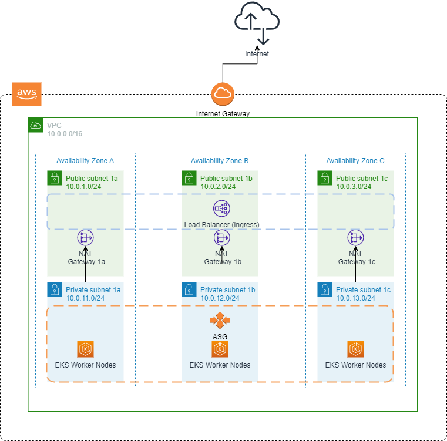

## terraform-aws-eks

A terraform module to create a managed Kubernetes cluster on AWS EKS.

## Usage
```hcl
terraform init

terraform apply -var-file="environments/dev.tfvars"
```

## Example
```hcl

module "network" {
  source = "./modules/network"

  project_name = var.project_name
  aws_region   = var.aws_region
  environment  = var.environment
  cidr_network = var.cidr_network

  cluster_name    = var.cluster_name
  public_subnets  = var.public_subnets
  private_subnets = var.private_subnets
}

module "master" {
  source = "./modules/master"

  project_name = var.project_name
  cluster_name = var.cluster_name
  environment  = var.environment
  k8s_version  = var.k8s_version

  cluster_vpc_id     = module.network.vpc_id
  private_subnets_id = module.network.private_subnets_id
  is_private         = var.is_private

  depends_on = [
    module.network
  ]
}

module "nodes" {
  source = "./modules/nodes"

  project_name = var.project_name
  cluster_name = var.cluster_name
  environment  = var.environment

  private_subnets_id   = module.network.private_subnets_id
  nodes_instances_size = var.nodes_instances_size
  auto_scale_options   = var.auto_scale_options

  auto_scale_cpu = var.auto_scale_cpu

  depends_on = [
    module.master
  ]
}

```

## Kubernetes
```hcl
# Apply filebeat
kubectl apply -f kubernetes/addons/filebeat.yaml

# Apply metric-server (we have 2 options, normal or HA
kubectl apply -f kubernetes/addons/metric-server.yaml
kubectl apply -f kubernetes/addons/metric-server-ha.yaml

# Apply Traefik as an Ingress controller
kubectl apply -f kubernetes/traefik/ingress.yml
```

## Requirements

| Name | Version |
|------|---------|
| <a name="requirement_terraform"></a> [terraform](#requirement\_terraform) | ~> 1.1.7 |
| <a name="requirement_aws"></a> [aws](#requirement\_aws) | ~> 4.14.0 |

## Providers

No providers.

## Modules

| Name | Source | Version |
|------|--------|---------|
| <a name="module_master"></a> [master](#module\_master) | ./modules/master | n/a |
| <a name="module_network"></a> [network](#module\_network) | ./modules/network | n/a |
| <a name="module_nodes"></a> [nodes](#module\_nodes) | ./modules/nodes | n/a |

## Resources

No resources.

## Inputs

| Name | Description | Type | Default | Required |
|------|-------------|------|---------|:--------:|
| <a name="input_auto_scale_cpu"></a> [auto\_scale\_cpu](#input\_auto\_scale\_cpu) | Set node group scale up and down thresholds | `any` | n/a | yes |
| <a name="input_auto_scale_options"></a> [auto\_scale\_options](#input\_auto\_scale\_options) | Set node group auto scale options - minimum, maximum and desired | `any` | n/a | yes |
| <a name="input_aws_region"></a> [aws\_region](#input\_aws\_region) | AWS Region | `any` | n/a | yes |
| <a name="input_cidr_network"></a> [cidr\_network](#input\_cidr\_network) | The CIDR block for the VPC | `any` | n/a | yes |
| <a name="input_cluster_name"></a> [cluster\_name](#input\_cluster\_name) | The name of the EKS Cluster. Used to name and tag resources | `any` | n/a | yes |
| <a name="input_environment"></a> [environment](#input\_environment) | The environment name. Used to name and tag resources | `any` | n/a | yes |
| <a name="input_is_private"></a> [is\_private](#input\_is\_private) | Set whether the EKS API will be private or public. Default is true | `any` | n/a | yes |
| <a name="input_k8s_version"></a> [k8s\_version](#input\_k8s\_version) | Set EKS cluster version | `any` | n/a | yes |
| <a name="input_nodes_instances_size"></a> [nodes\_instances\_size](#input\_nodes\_instances\_size) | Node instance size. Default t3.large | `any` | n/a | yes |
| <a name="input_private_subnets"></a> [private\_subnets](#input\_private\_subnets) | A map of private subnets inside the VPC. It requires a minimum of at least 3 subnets | `any` | n/a | yes |
| <a name="input_project_name"></a> [project\_name](#input\_project\_name) | The project name. Used to name and tag resources | `any` | n/a | yes |
| <a name="input_public_subnets"></a> [public\_subnets](#input\_public\_subnets) | A map of public subnets inside the VPC. It requires a minimum of at least 3 subnets | `any` | n/a | yes |

## Outputs

| Name | Description |
|------|-------------|
| <a name="output_configure_kubectl"></a> [configure\_kubectl](#output\_configure\_kubectl) | Kubectl command to configure access to the EKS cluster |
| <a name="output_private_subnets_id"></a> [private\_subnets\_id](#output\_private\_subnets\_id) | Get private subnets id from network module |
| <a name="output_public_subnets_id"></a> [public\_subnets\_id](#output\_public\_subnets\_id) | Get public subnets id from network module |
| <a name="output_vpc_id"></a> [vpc\_id](#output\_vpc\_id) | Get VPC ID from network module |

## Architecture


